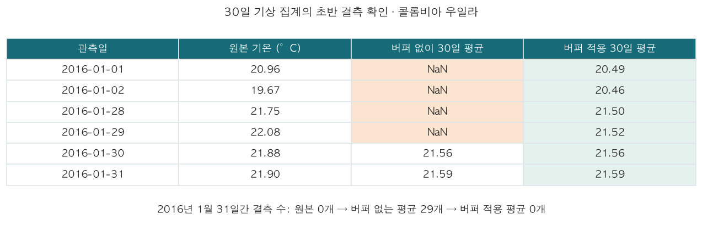

# 데이터를 모으고 분석하며 겪은 문제

## 기상 원자료는 있는데 rolling 결과가 비었다

처음에는 30일 기상 집계의 빈칸을 중앙값으로 채웠다. 원자료를 다시 보니 결측이 아니라 계산 시작점의 문제였다. 1월 1일부터 잘라서 30일 이동평균을 구하면 첫 29일은 관측 수가 모자란다.

위 이미지는 이전 2016년 우일라 분석의 실제 출력이다. 새 03의 출력과 혼동하지 않도록 남긴다. 지금은 2014년 7월부터 자료를 받아 2015년 이전을 계산 버퍼로 쓴다. 30·90일 집계와 이전 가뭄을 계산한 뒤 확인하니 여섯 지점 모두 첫 학습일과 Train의 기상 피처 결측이 0개였다. 평균·중앙값 대치는 하지 않았다.

월별 Train 평균을 빼는 것은 이상기후 편차의 기준을 잡는 일이다. 빈 관측값을 평균으로 채우는 일과는 다르다. 미래 쪽 버퍼도 저장되어 있지만 과거 피처 계산에는 들어가지 않는다.

## 가격 누락을 먼저 지우면 거래일 간격이 달라진다

새 백필의 거래일 달력에는 2014-09-18, 2016-10-10, 2016-11-11, 2018-12-05의 가격이 비어 있다. 앞의 한 날짜는 버퍼, 나머지 세 날짜는 Train에 해당한다. 반대로 Yahoo에는 휴장일의 행도 있다.

커피 거래일을 먼저 정렬하고 빈 칸을 남긴 채 `shift(-h)`를 적용했다. 가격이 필요한 입력·정답을 만들 수 없는 사례만 마지막에 제외한다. 빈 행을 먼저 삭제하면 5거래일 뒤라고 만든 정답이 실제로는 더 먼 날짜가 될 수 있다. 합성 가격에 결측 한 칸을 넣어 이 차이를 검사했다.

## 종가가 고가·저가 밖으로 나갔다

파일럿에서 Yahoo 원응답·yfinance·저장값을 대조했을 때 같은 불일치가 있었다. 이번 2014년 7월~2025년 백필에도 커피 종가의 OHLC 범위 이탈이 455행 있었다. 수집 과정에서 잘라내거나 보간하지 않았다.

선물 정산가와 마지막 체결가는 다를 수 있다. 다만 Yahoo의 일별 계약 연결 규칙과 계약별 공식 정산가를 대조하지 못해 정산이나 롤오버를 확정 원인으로 쓰지는 않는다. 종가 위주의 피처를 사용하고, 로그수익률에도 계약 연결 영향이 남을 수 있음을 적었다. 이전 파일럿 결과는 [01 notebook](../data_code/01_small_batch_probe.ipynb)에 남아 있다.

## 관측일이 곧 공개일은 아니었다

FRED 현재값에 며칠을 더하는 방식으로는 당시 수정 전 값을 복원할 수 없다. 금리·BRL 환율·WTI는 ALFRED의 `output_type=4`로 최초 공개값과 공개 날짜를 함께 저장하도록 바꿨다. 공개 시각까지는 없어서 다음 날부터 쓴다. 처음 공개된 값을 유지하는 정책이며 이후의 모든 수정본을 반영하는 정책은 아니다.

DFF의 모든 과거 공개본을 한 번에 요청하자 API가 2,000개 공개본 제한으로 400을 반환했다. 관측 연도별로 요청하고 다음 해 상반기까지의 공개 기간을 포함해 해결했다. 응답의 관측일·공개 날짜·중복·범위를 확인했고 키가 포함된 URL은 출력하지 않았다.

달러지수는 기간만 맞춰서 쓸 수 없었다. `DTWEXBGS`는 2019년 도입 당시 과거 값을 소급 제공한 계열이라 2015년 당시 알려진 지수로 사용할 수 없다. COT도 셧다운·발표 지연이 있어 화요일+3일로 일괄 처리할 수 없다. 두 자료는 보관하고 이번 기본 입력에서는 제외했다.

Yahoo·NASA의 수정 전 자료는 확보하지 못했다. 사용자가 승인한 현재 제공 자료 기반 연구용 비교로 진행하며, ALFRED 공개본과 같은 수준의 과거 시점 복원을 했다고 쓰지 않는다.

## 가뭄×서리를 만들었지만 값이 전부 0이었다

브라질 세 지점의 격자 최저기온으로 0°C 미만 강도를 계산했다. Train에서 서리와 가뭄×서리 여섯 피처가 모두 상수였다. 모델에서 제외했고, 실제 서리 효과를 검증했다고 해석하지 않았다.

격자 평균의 저온은 농장 단위 서리 관측과 다르다. 임계값을 높여 5°C나 10°C를 서리로 부르는 식으로 신호를 만들지는 않았다. 이번 기후 그룹 비교는 강수·기온 편차, 강수 결손과 월 주기 변수의 효과를 보는 실험이다.

## 중복이 줄었다고 예측 오차도 줄지는 않는다

이전 실험에서는 VIF를 낮춰도 CatBoost 오차가 개선되지 않았다. 이번에는 Train의 기상 상관이 0.90 이상인 쌍에서 타깃 관계가 약한 쪽을 제외한 후보를 만들고, 원본 구성과 같은 날짜·CatBoost 설정으로 비교하도록 구성했다. 실제 월별 편차 입력에서는 최대 상관이 약 0.886이라 제거 기준에 해당하는 쌍이 없었다. 같은 피처의 순서만 바꾼 구성을 축소 실험으로 세지 않고 생략했다.

가격에 기후·거시를 각각 더하고 함께 넣는 그룹 비교도 추가했다. 한 변수의 단독 실패로 나머지를 버리지 않는다. CCF의 최고 상관 시차도 바로 피처로 채택하지 않는다. 입력 시차와 예측 기간을 나누고, 큰 상관이 실제 Validation 오차 감소로 이어지는지 따로 확인한다.

## 통계 모델의 업데이트도 확인해야 했다

이전 sktime 지수평활 경로에서는 `update_params=False`가 새 관측을 예상대로 반영하지 않는 경우가 있었다. 새 03은 statsmodels 상태공간 결과에 관측을 `append(refit=False)`하고 PyCaret에는 이 모델을 연결한다. 가격의 빈 칸은 관측 갱신을 건너뛰며 날짜를 유지한다.

평가 루프는 분위수가 아닌 점예측을 요청하고 예측 인덱스가 정확히 `t+h`인지 검사한다. 같은 방식을 Validation과 Test에 적용한다. 결과가 Naive와 비슷하다는 사실만으로 시장 효율성이나 과적합이 없음을 증명했다고 쓰지 않는다.

재학습 구간에서 ARIMA 기본 최적화의 수렴 실패도 확인했다. 로그가격의 작은 분산은 집중 우도로 처리하고, Powell 최적화를 Validation·Test 양쪽에 동일하게 적용했다. 수렴하지 않은 결과를 그대로 비교표에 넣지는 않았다.
